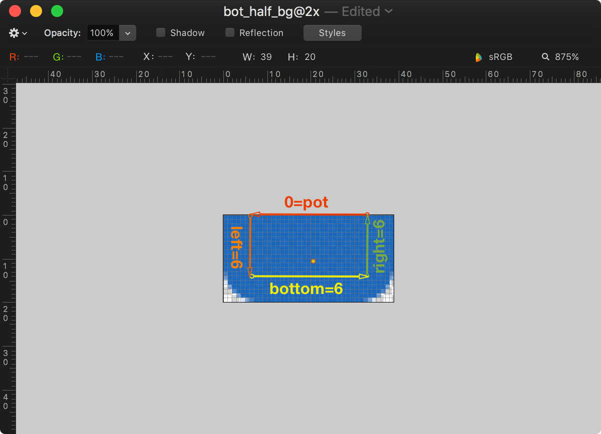
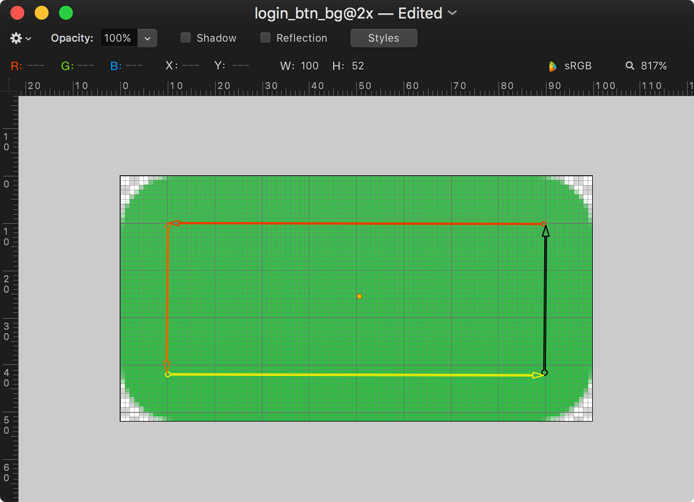
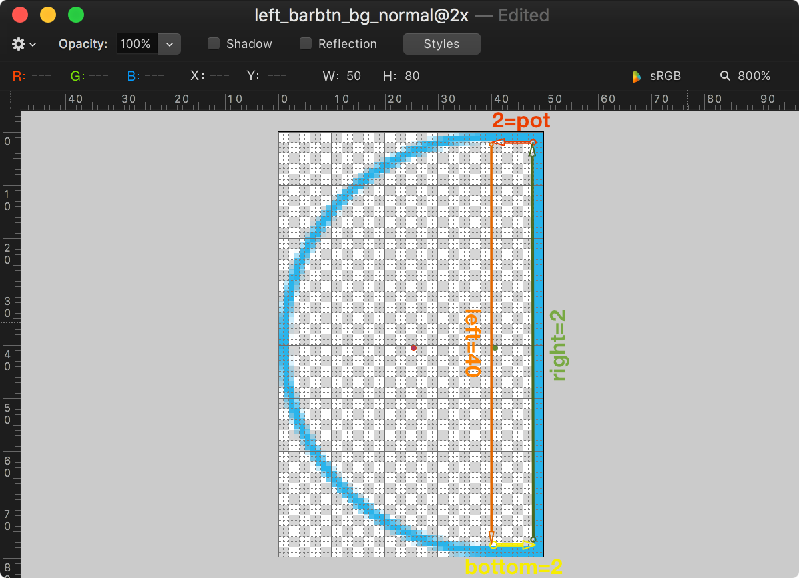
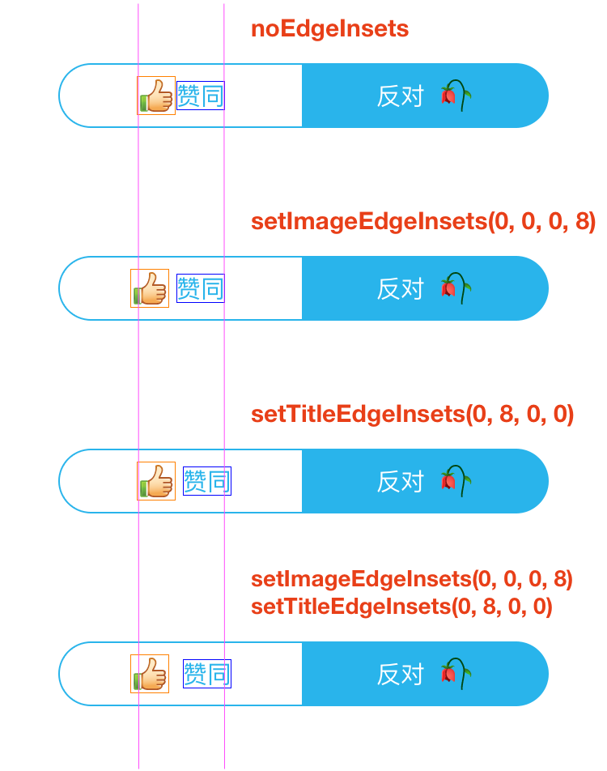
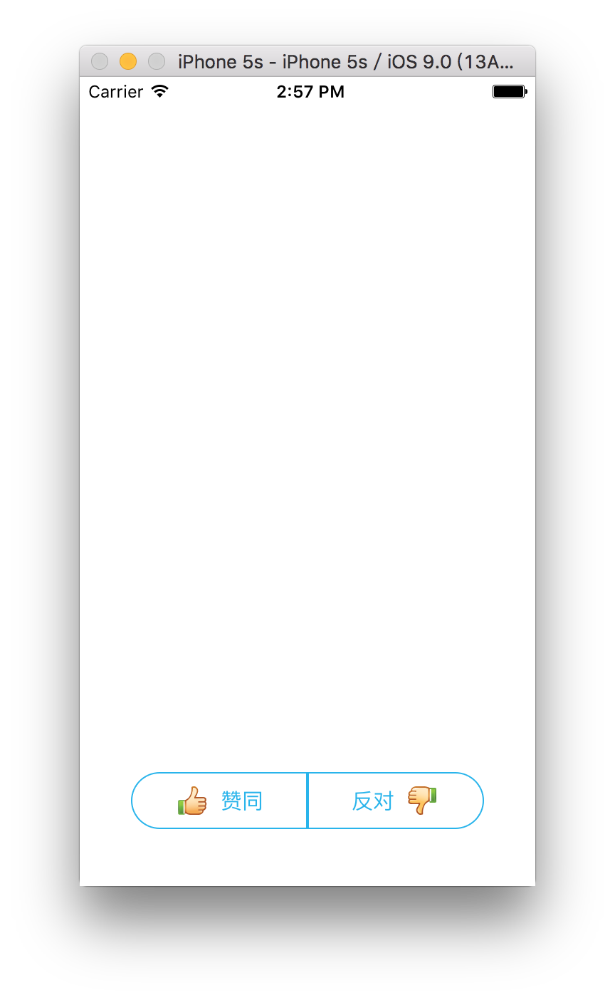
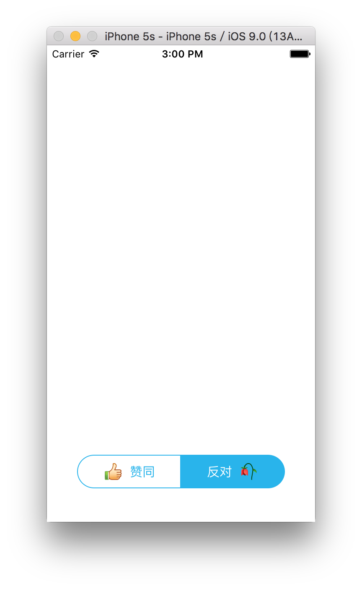
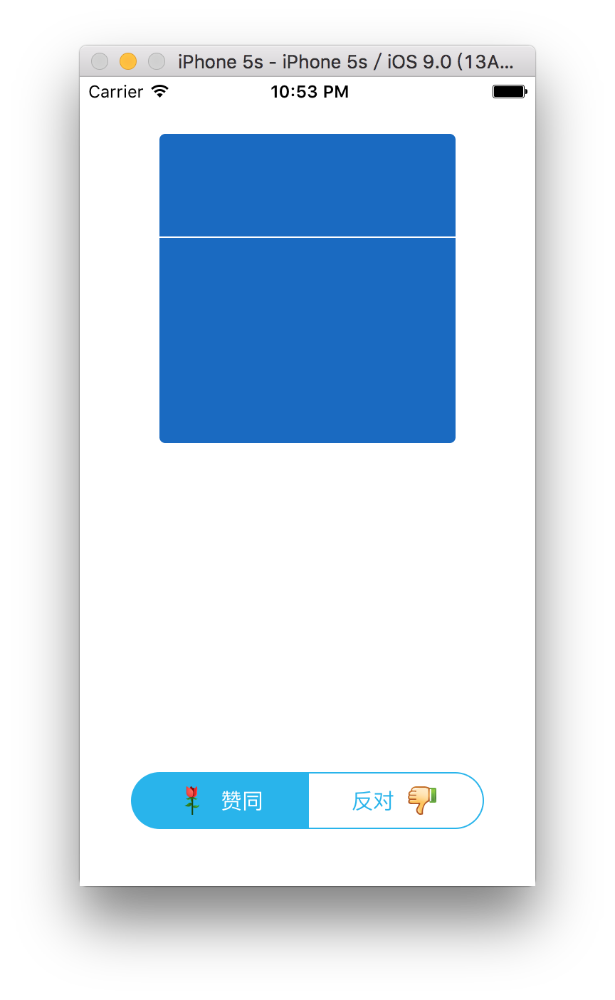
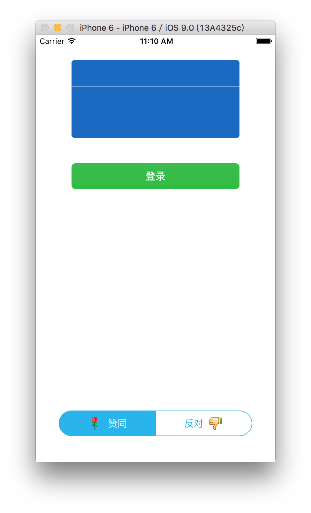
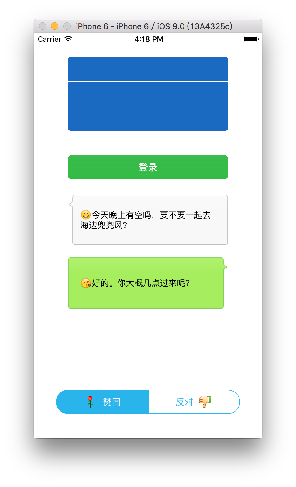

# resizableImage
demo for **stretchable/resizable** UIImage and UIButton's **EdgeInsets** property for imageView & titleLabel.

## testVerticalResizable

testVerticalResizable 例程演示了纵向半椭圆封盖属性的应用。

### topBgImage
上半部 topBgImage 基于中心点拉伸贴图。

```
topBgImage = [topBgImage resizableImageWithCapInsets:CENTER_PIXEL_CAPINSETS_OF_IMAGE(topBgImage)
```

### botBgImage
下半部 botBgImage 基于封盖 tiling 围封部分填充贴图。

```
// tiling底部椭圆上的围封矩形部分：
botBgImage = [botBgImage resizableImageWithCapInsets:BOT_IMGVIEW_CAPINSETS /*resizingMode:UIImageResizingModeStretch*/]; // 默认Tile，可测试Stretch
```



## testRoundedRectButton
testRoundedRectButton 例程演示了横向圆角按钮效果的实现。

CapInsets 封盖剔除四周圆角部分，tiling 或 streching 围封矩形。

### CENTER_PIXEL_CAPINSETS
方式1：stretching 中心点

```
// stretching the is 1 x 1 pixel region, provides the fastest performance.
// loginBtnBgImg = [loginBtnBgImg resizableImageWithCapInsets:CENTER_PIXEL_CAPINSETS_OF_IMAGE(loginBtnBgImg) /*resizingMode:UIImageResizingModeTile*/]; // 默认Stretch，可测试Tile

RESIZABLE_IMAGE_BY_STRETCHING_CENTER_PIXEL(loginBtnBgImg);
```

### LOGIN_BTN_CAPINSETS
方式2：stretching 椭圆中间围封的矩形部分：

```
// stretching the interior area not covered by the cap
loginBtnBgImg = [loginBtnBgImg resizableImageWithCapInsets:LOGIN_BTN_CAPINSETS resizingMode:UIImageResizingModeStretch]; // 默认Tile，测试Stretch
```



### UIImage(UIColor)
通过 UIView.CALayer 的 setCornerRadius 接口设置边框圆角半径。  
通过 `+[UIImage(UIColor) imageFromColor:]` 扩展接口可基于颜色绘制纯色背景，免用贴图资源。

```
    [_loginButton.layer setMasksToBounds:YES];
    [_loginButton.layer setCornerRadius:LOGIN_BUTTON_CORNER_RADIUS];
    [_loginButton setBackgroundImage:[UIImage resizableImageFromColor:RGBCOLOR(54, 187, 72)] forState:UIControlStateNormal];
```

## testResizableBubble
testResizableBubble 例程演示了类微信聊天气泡拉伸效果的实现。

### CENTER_PIXEL_CAPINSETS
方式1：stretching 中心点，箭头中心点会被纵向拉伸！

```
friendBubbleBgImg = [friendBubbleBgImg resizableImageWithCapInsets:CENTER_PIXEL_CAPINSETS_OF_IMAGE(friendBubbleBgImg) /*resizingMode:UIImageResizingModeTile*/]; // 默认Stretch，可测试Tile
```

### resizableImageWithCapInsets 中部矩形
方式2：tiling 中间围封的矩形部分(4, 11, 4, 4)：  
默认 tiling 模式下左侧纵向填充出现3个箭头；指定 stretch 模式，则箭头会沿中心点纵向拉伸钝化。

```
friendBubbleBgImg = [friendBubbleBgImg resizableImageWithCapInsets:UIEdgeInsetsMake(4, 11, 4, 4) /*resizingMode:UIImageResizingModeStretch*/]; // 默认Tile，可测试Stretch
```

### resizableImageWithCapInsets 右下矩形
方式3：tiling 中间围封的矩形部分(21, 11, 4, 4)：  
保留箭头所在左上部分，右下方向填充/拉伸，实现预期拉伸效果！

```
friendBubbleBgImg = [friendBubbleBgImg resizableImageWithCapInsets:UIEdgeInsetsMake(21, BUBBLE_ANGLE_SIDE_MARGIN, BUBBLE_CORNER_RADIUS, BUBBLE_CORNER_RADIUS) /*resizingMode:UIImageResizingModeStretch*/]; // 默认Tile，可测试Stretch
```


## testCapsuleRoundedButton
testCapsuleRoundedButton 例程演示了横向半椭圆封盖属性的应用。

> 点击按钮为选择态，背景变蓝，字体变白，图标改变。
> 左按钮为左图标右标题，右按钮为***左标题右图标***，图标和标题间距为 8pt。

`胶囊按钮`综合演示了：

+ 按钮背景贴图（setBackgroundImage）：  
	> -[UIImage *resizableImageWithCapInsets*:resizingMode:]  
+ 按钮图标及标题的间距控制（imageView/titleLabel EdgeInsets）：  
  	> -[UIButton *setImageEdgeInsets*:]   
	> -[UIButton *setTitleEdgeInsets*:]   

### resizable Background Image
方式1：stretching 中心点，纵向拉伸椭圆圆角部分至顶，导致右侧纵向饱满部分也向上鼓胀。

```
RESIZABLE_IMAGE_BY_STRETCHING_CENTER_PIXEL(leftNorBgImg);
```

方式2：stretching 右侧点，保留左侧椭圆，右侧正确拉伸。但是按下态不正常！

```
RESIZABLE_IMAGE_BY_INTERIOR_PIXEL(leftNorBgImg, BARBTN_CORNER_RADIUS, BARBTN_CORNER_RADIUS);
```

方式3：tiling 右侧围封的非椭圆区矩形部分，实现预期拉伸效果！

```
leftNorBgImg = [leftNorBgImg resizableImageWithCapInsets:LEFT_BARBTN_CAPINSETS /*resizingMode:UIImageResizingModeStretch*/]; // 默认Tile，可测试Stretch
```



### UIButton's EdgeInsets

详情参考 《[setImageEdgeInsets&setTitleEdgeInsets.md](ScreenShots/testCapsuleRoundedButton/setImageEdgeInsets&setTitleEdgeInsets.md)》



---

## 整体效果截图
1.初始胶囊按钮，背景为蓝圈白底，字体为蓝色。左右按钮初始图标分别为大拇指竖起和大拇指向下。  


2.选择左胶囊按钮，背景变蓝，字体变白，图标由大拇指竖起变为一朵鲜花。  


3.选择右胶囊按钮，背景变蓝，字体变白，图标由大拇指向下变为一朵枯萎。  


4.增加纵向UIImageView胶囊贴图效果：  


5.增加登录按钮贴图效果：  


6.增加微信聊天气泡效果：  

